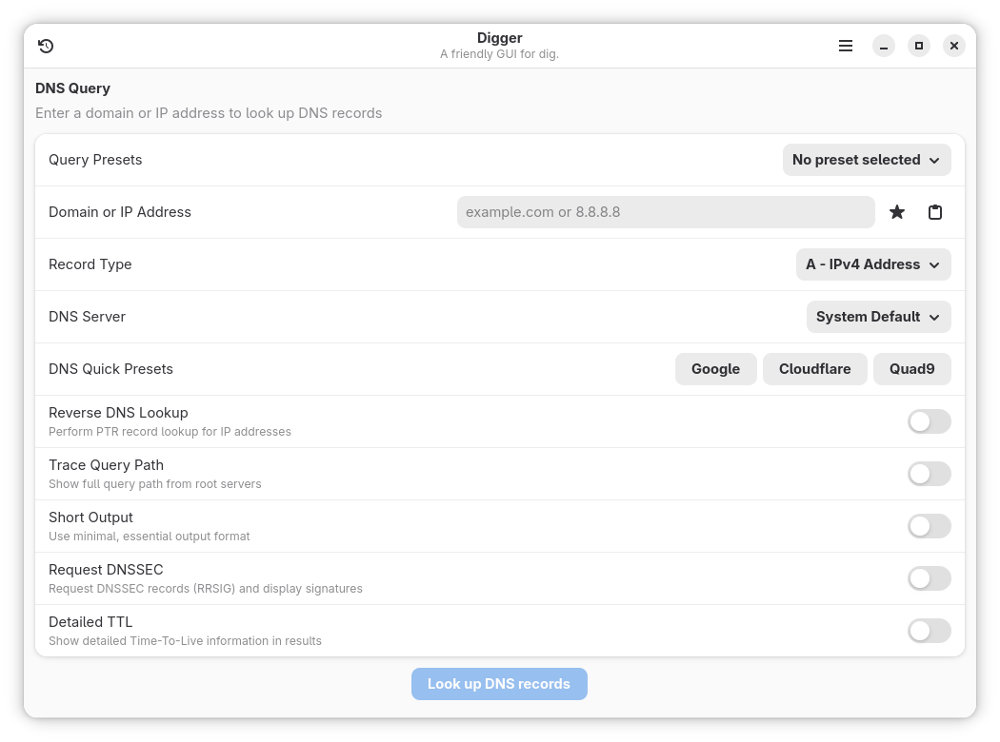
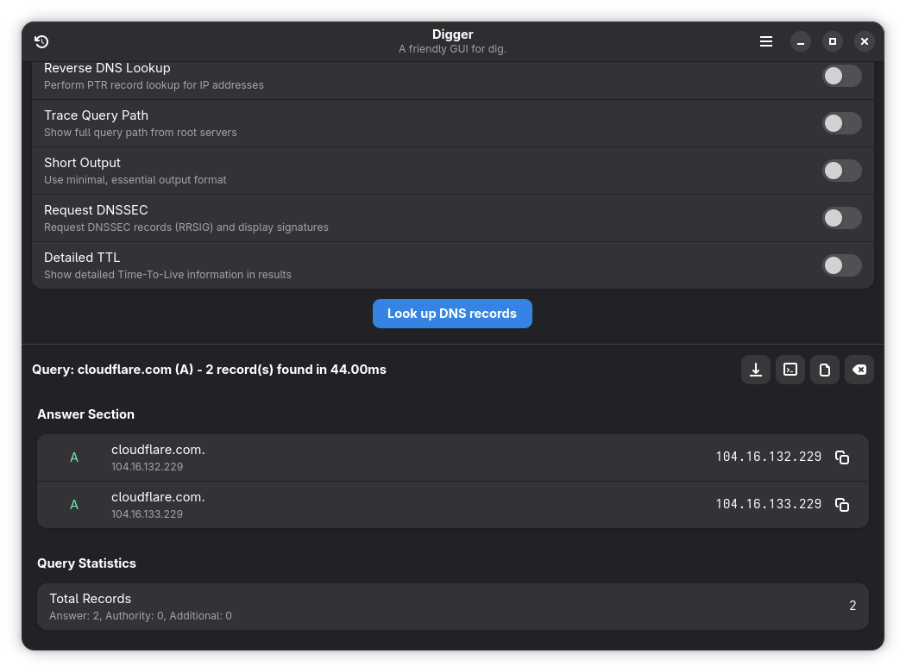
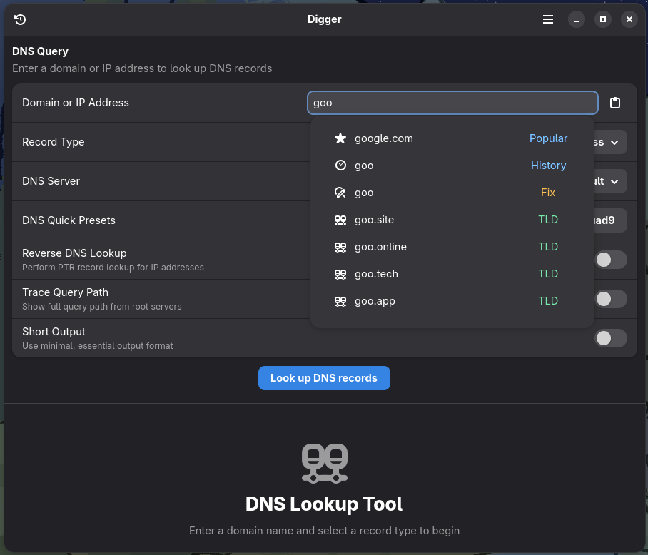
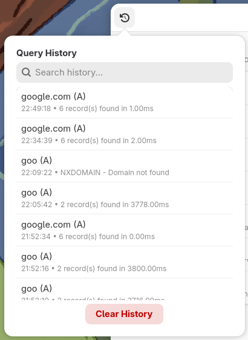
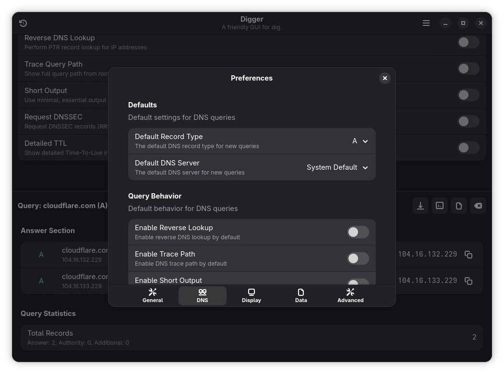
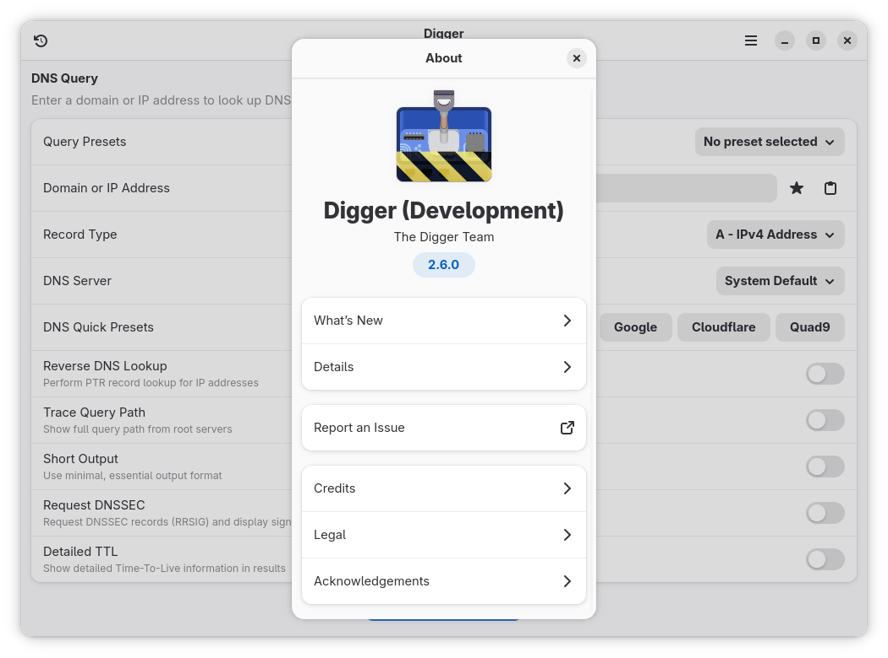

# Digger - Advanced DNS Lookup Tool

A powerful and modern DNS lookup tool built with Vala, GTK4, and libadwaita. Digger provides an intuitive interface for performing DNS queries with advanced features including batch lookups, server comparison, DNSSEC validation, and DNS-over-HTTPS support.

## Screenshots

<div align="center">

### Main Interface

*Clean, modern interface for DNS lookups with instant autocomplete suggestions*

### DNS Query Results

*Detailed DNS record information with one-click copying and export capabilities*

### Smart Autocomplete

*Intelligent domain suggestions with keyboard navigation and favorites system*

### Query History

*Advanced search and filtering through your DNS query history*

### Preferences

*Comprehensive settings for customizing behavior, DoH providers, and DNSSEC validation*

### About Dialog

*Modern about dialog with automatic release notes and comprehensive information*

</div>

## ✨ Features

### Core DNS Features
- 🔍 **Comprehensive DNS Queries**: Support for all major DNS record types (A, AAAA, CNAME, MX, NS, PTR, TXT, SOA, SRV, DNSKEY, DS, RRSIG, ANY)
- ⚙️ **Advanced Query Options**: Reverse DNS lookup, trace queries, custom DNS servers, and short output format
- 🔒 **DNS-over-HTTPS (DoH)**: Secure DNS queries with support for Cloudflare, Google, Quad9, and custom endpoints
- 🛡️ **DNSSEC Validation**: Verify DNSSEC chain of trust with DNSKEY, DS, and RRSIG record validation
- 🔄 **Server Comparison**: Compare DNS responses across multiple servers with automatic discrepancy detection

### Productivity Features
- ⭐ **Favorites System**: Star and save frequently queried domains with their record types
- 📦 **Batch Lookup**: Import and query multiple domains from CSV/TXT files with progress tracking
- 📤 **Export Manager**: Export query results to JSON, CSV, plain text, or DNS zone file formats
- 📝 **Enhanced Query History**: Persistent history with advanced search, filtering, and management
- 🔄 **Smart Autocomplete**: Intelligent domain suggestions with usage tracking and quick selection

### User Experience
- 📋 **Clipboard Integration**: One-click copying of DNS record values and raw dig output
- ⌨️ **Keyboard Shortcuts**: Comprehensive keyboard shortcuts for efficient navigation
- 🎨 **Modern Interface**: Clean, adaptive UI built with libadwaita 1.8 and blueprint templates
- 🌐 **Network Diagnostics**: Detailed error handling with NXDOMAIN, SERVFAIL, and timeout detection
- ⚙️ **Comprehensive Preferences**: Multi-page preferences with DNS defaults, DoH configuration, and DNSSEC settings
- 🚀 **Native Performance**: Vala implementation for optimal speed and resource usage

## Installation

### Flatpak (Recommended)

```bash
# Install from Flathub
flatpak install flathub io.github.tobagin.digger
flatpak run io.github.tobagin.digger
```

### Building from Source

> **Note**: Building uses Flatpak, so no system dependencies are required. All dependencies are automatically handled by the build scripts.

#### Using Build Scripts (Recommended)
```bash
git clone https://github.com/tobagin/digger.git
cd digger

# Production build
./scripts/build.sh

# Development build (with debug info)
./scripts/build.sh --dev

# Build and run development version
./scripts/build.sh --dev --run
```

#### Using Flatpak Builder (Manual)
```bash
git clone https://github.com/tobagin/digger.git
cd digger

# Install Flatpak build dependencies
sudo dnf install flatpak flatpak-builder  # Fedora/RHEL
# sudo apt install flatpak flatpak-builder  # Ubuntu/Debian
# sudo pacman -S flatpak flatpak-builder    # Arch Linux

# Add Flathub repository and install GNOME SDK
flatpak remote-add --if-not-exists flathub https://dl.flathub.org/repo/flathub.flatpakrepo
flatpak install flathub org.gnome.Platform//49 org.gnome.Sdk//49

# Build and install (Production)
flatpak-builder --user --install --force-clean build-dir packaging/io.github.tobagin.digger.yml
flatpak run io.github.tobagin.digger

# Build and install (Development)
flatpak-builder --user --install --force-clean build-dir-dev packaging/io.github.tobagin.digger.Devel.yml
flatpak run io.github.tobagin.digger.Devel
```

## Usage

### Basic DNS Lookup
1. Enter a domain name (e.g., `example.com`)
2. Select the DNS record type
3. Click "Look up DNS records" or press Enter
4. Click the star icon to add to favorites

### Batch Lookup
1. Click the menu button → "Batch Lookup" (or press `Ctrl+B`)
2. Import domains from CSV/TXT file or enter manually
3. Select record type and DNS server
4. Choose parallel or sequential execution
5. Monitor progress and export results

### Server Comparison
1. Click the menu button → "Tools" → "Compare DNS Servers" (or press `Ctrl+M`)
2. Enter domain and select record type on the Setup page
3. Choose DNS servers to compare (Google, Cloudflare, Quad9, OpenDNS, System)
4. Click "Compare DNS Servers" to begin comparison
5. View response times, statistics, and detect discrepancies on the Results page
6. Export comparison results to JSON, CSV, or TXT format

### DNS-over-HTTPS (DoH)
1. Open Preferences → Advanced
2. Enable "DNS-over-HTTPS"
3. Select provider (Cloudflare, Google, Quad9) or enter custom endpoint
4. All queries will now use encrypted DNS

### DNSSEC Validation
1. Open Preferences → Advanced
2. Enable "DNSSEC Validation"
3. Optionally enable "Show DNSSEC Details"
4. Query results will show DNSSEC validation status

### Export Results
1. Perform a DNS query
2. Click "Export" button in results view
3. Choose format (JSON, CSV, Plain Text, DNS Zone File)
4. Select save location

### Advanced Options
Expand the "Advanced Options" section to access:
- **Reverse DNS Lookup**: Check for IP address reverse resolution
- **Trace Query Path**: See the full resolution path from root servers
- **Short Output**: Get minimal, essential output only
- **Custom DNS Server**: Specify a custom DNS server (e.g., 8.8.8.8)

### Keyboard Shortcuts
- `Ctrl+L`: Focus the domain entry field
- `Ctrl+R`: Repeat the last query
- `Ctrl+B`: Open batch lookup dialog
- `Ctrl+M`: Open server comparison dialog
- `Ctrl+,`: Open preferences
- `Ctrl+?`: Show keyboard shortcuts
- `F1`: Show about dialog
- `Escape`: Clear results
- `Enter`: Submit query

## Architecture

Digger follows a clean, modular architecture with organized source code:

```
Digger/
├── src/
│   ├── Main.vala                           # Application entry point
│   ├── Application.vala                    # Main application class
│   ├── Config.vala.in                      # Configuration template
│   ├── dialogs/                            # Dialog windows
│   │   ├── Window.vala                     # Main window
│   │   ├── AboutDialog.vala                # About dialog with release notes
│   │   ├── PreferencesDialog.vala          # Multi-page preferences
│   │   ├── ShortcutsDialog.vala            # Keyboard shortcuts
│   │   ├── BatchLookupDialog.vala          # Batch DNS lookup
│   │   └── ComparisonDialog.vala           # Server comparison
│   ├── models/                             # Data models
│   │   └── DnsRecord.vala                  # DNS record data structures
│   ├── services/                           # Business logic services
│   │   ├── DnsQuery.vala                   # DNS query execution
│   │   ├── QueryHistory.vala               # History management
│   │   ├── SecureDns.vala                  # DNS-over-HTTPS implementation
│   │   └── DnssecValidator.vala            # DNSSEC validation logic
│   ├── managers/                           # Feature managers
│   │   ├── ExportManager.vala              # Export to various formats
│   │   ├── FavoritesManager.vala           # Favorites persistence
│   │   ├── BatchLookupManager.vala         # Batch operation orchestration
│   │   └── ComparisonManager.vala          # Multi-server comparison
│   ├── widgets/                            # UI components
│   │   ├── EnhancedQueryForm.vala          # Modern query input
│   │   ├── EnhancedResultView.vala         # Results display with export
│   │   ├── QueryResultView.vala            # Legacy results view
│   │   ├── AdvancedOptions.vala            # Advanced options panel
│   │   ├── AutocompleteDropdown.vala       # Smart autocomplete widget
│   │   └── EnhancedHistorySearch.vala      # Advanced history search
│   └── utils/                              # Utility classes
│       ├── ThemeManager.vala               # Theme management
│       ├── DnsPresets.vala                 # DNS server presets
│       └── DomainSuggestions.vala          # Autocomplete engine
├── data/
│   ├── ui/                                 # Blueprint UI templates
│   │   ├── window.blp                      # Main window UI
│   │   ├── dialogs/                        # Dialog UI files
│   │   │   ├── preferences-dialog.blp
│   │   │   ├── shortcuts-dialog.blp
│   │   │   ├── batch-lookup-dialog.blp
│   │   │   └── comparison-dialog.blp
│   │   └── widgets/                        # Widget UI files
│   │       ├── enhanced-query-form.blp
│   │       ├── enhanced-result-view.blp
│   │       ├── advanced-options.blp
│   │       ├── autocomplete-dropdown.blp
│   │       ├── enhanced-history-search.blp
│   │       └── history-popover.blp
│   ├── io.github.tobagin.digger.gschema.xml      # GSettings schemas
│   ├── io.github.tobagin.digger.metainfo.xml.in  # AppStream metadata
│   ├── io.github.tobagin.digger.desktop.in       # Desktop entry
│   ├── icons/                              # Application icons (SVG scalable)
│   │   └── hicolor/scalable/apps/
│   │       ├── io.github.tobagin.digger.svg                        # Main app icon
│   │       ├── io.github.tobagin.digger-history-symbolic.svg
│   │       ├── io.github.tobagin.digger-copy-symbolic.svg
│   │       ├── io.github.tobagin.digger-error-symbolic.svg
│   │       ├── io.github.tobagin.digger-success-symbolic.svg
│   │       ├── io.github.tobagin.digger-fastest-server-symbolic.svg
│   │       ├── io.github.tobagin.digger-slowest-server-symbolic.svg
│   │       ├── io.github.tobagin.digger-average-query-time-symbolic.svg
│   │       └── io.github.tobagin.digger-query-time-symbolic.svg
│   ├── screenshots/                        # Application screenshots
│   └── presets/                            # DNS server presets
├── packaging/                              # Flatpak manifests
│   ├── io.github.tobagin.digger.yml        # Production manifest
│   └── io.github.tobagin.digger.Devel.yml  # Development manifest
├── scripts/                                # Build and utility scripts
│   └── build.sh                            # Unified build script
└── po/                                     # Translations
```

## DNS Integration

Digger uses the embedded `dig` command (BIND 9.16.48) for DNS resolution, providing:
- **Enhanced Error Handling**: Proper parsing of NXDOMAIN, SERVFAIL, REFUSED, and other DNS status codes
- **Comprehensive Record Support**: All standard DNS record types with proper parsing
- **Advanced Query Options**: Tracing, custom servers, reverse lookups, and short output
- **DNSSEC Support**: Full DNSSEC validation with DNSKEY, DS, and RRSIG records
- **DoH Integration**: DNS-over-HTTPS using libsoup-3.0 with RFC 1035 wire format
- **Detailed Diagnostics**: Query timing, server information, and comprehensive status reporting
- **Self-Contained**: Embedded dig command in Flatpak builds eliminates external dependencies

## Contributing

Contributions are welcome! Please feel free to submit issues and pull requests.

### Development Setup
1. Fork the repository
2. Create a feature branch
3. Make your changes following the coding guidelines
4. Test thoroughly with various DNS queries
5. Submit a pull request

### Coding Guidelines
- Follow PascalCase naming for Vala files (e.g., `DnsQuery.vala`)
- Organize code into appropriate folders (dialogs, models, services, managers, widgets, utils)
- Add appropriate error handling with null checks
- Use Blueprint for UI definitions
- Include descriptive commit messages
- Test changes with various DNS record types and scenarios

### Project Structure
- Place dialogs in `src/dialogs/`
- Place data models in `src/models/`
- Place business logic in `src/services/`
- Place feature managers in `src/managers/`
- Place UI components in `src/widgets/`
- Place utility classes in `src/utils/`
- Place Blueprint UI files in `data/ui/dialogs/` or `data/ui/widgets/`

## License

This project is licensed under the GNU General Public License v3.0 - see the [LICENSE](LICENSE) file for details.

## Acknowledgments

- Built with [Vala](https://vala.dev/) and [GTK4](https://gtk.org/)
- UI components from [libadwaita 1.8](https://gnome.pages.gitlab.gnome.org/libadwaita/)
- DNS resolution powered by [BIND dig](https://www.isc.org/bind/)
- Inspired by the classic `dig` command-line tool
- Thanks to the GNOME and GTK communities for excellent documentation

## Recent Updates

### ✨ Version 2.3.0 - UI/UX Improvements & Critical Fixes (Latest)

**UI/UX Enhancements:**
- **Redesigned Comparison Dialog**: Two-page architecture (Setup → Results) for cleaner, more focused interface
- **Custom Icons**: Added custom symbolic icons for fastest-server, slowest-server, average-query-time, and query-time
- **Semantic Record Type Icons**: Visual icons replace colored text labels for DNS record types (A, AAAA, MX, CNAME, NS, TXT, SOA, PTR, SRV)
- **System Default Display**: Shows "System Default (localhost)" for clarity when using default DNS server
- **Menu Integration**: Added Batch Lookup and Compare DNS Servers to Tools menu for better discoverability

**Critical Bug Fixes:**
- **Fixed UI Freeze**: Comparison dialog now uses sequential async with 50ms yields, keeping UI fully responsive during multi-server queries
- **Fixed Results Accumulation**: Comparison results properly clear between runs using reusable rows pattern
- **Fixed False Positives**: Set-based discrepancy detection eliminates false warnings when DNS records return in different order

**Performance Improvements:**
- **Reusable Widgets**: Statistics rows created once and updated instead of removed/recreated for better performance
- **Enhanced Export**: Full JSON/CSV/TXT export with smart filename generation for comparison results

### 🎉 Version 2.2.0 - Major Feature Release

**New Features:**
- **Export Manager**: Export query results to JSON, CSV, plain text, or DNS zone file formats
- **Favorites System**: Star and save frequently queried domains with their record types
- **Batch Lookup**: Import and query multiple domains from CSV/TXT files with progress tracking
- **Server Comparison**: Compare DNS responses across multiple servers with discrepancy detection
- **DNS-over-HTTPS (DoH)**: Secure DNS queries with Cloudflare, Google, Quad9, and custom endpoint support
- **DNSSEC Validation**: Verify DNSSEC chain of trust with DNSKEY, DS, and RRSIG record validation
- **Advanced Preferences**: Configure DoH providers and DNSSEC validation settings
- **Enhanced About Dialog**: Comprehensive about dialog with automatic release notes display

**Code Organization:**
- Renamed all Vala files to PascalCase naming convention
- Organized source code into logical folders (dialogs, models, services, managers, widgets, utils)
- Organized Blueprint UI files into dialogs and widgets folders
- Moved screenshots to data folder for better organization

**Technical Improvements:**
- Updated keyboard shortcuts to Libadwaita 1.8 ShortcutsDialog API
- Improved stability with defensive null checks for GSettings
- Enhanced metainfo with comprehensive v2.2.0 release notes
- Better error handling throughout the application

### 🚀 Version 2.1.4 - Enhanced Metadata
- Added comprehensive project links (help, donations, contact, contribution)
- Enhanced AppStream metadata for better app store integration
- Improved project visibility and user support resources

### 🚀 Version 2.1.3 - Runtime Updates
- Updated to GNOME runtime version 49
- Improved compatibility with latest GNOME platform

### 🚀 Version 2.1.2 - Critical Bug Fix
- Fixed application crash when changing DNS servers via dropdown
- Fixed crash with DNS quick preset buttons (Google, Cloudflare, Quad9)
- Resolved index out of bounds error in DNS server selection
- Improved DNS server dropdown stability

### 🚀 Version 2.0.0 - Complete Vala Rewrite
- **Native Performance**: Complete rewrite from Python to Vala
- **Enhanced DNS Parsing**: Proper handling of all DNS status codes
- **Modern UI**: GTK4 and libadwaita with Blueprint templates
- **Self-Contained**: Embedded dig command eliminates external dependencies

---

**Made with ❤️ using Vala, GTK4, and libadwaita**
