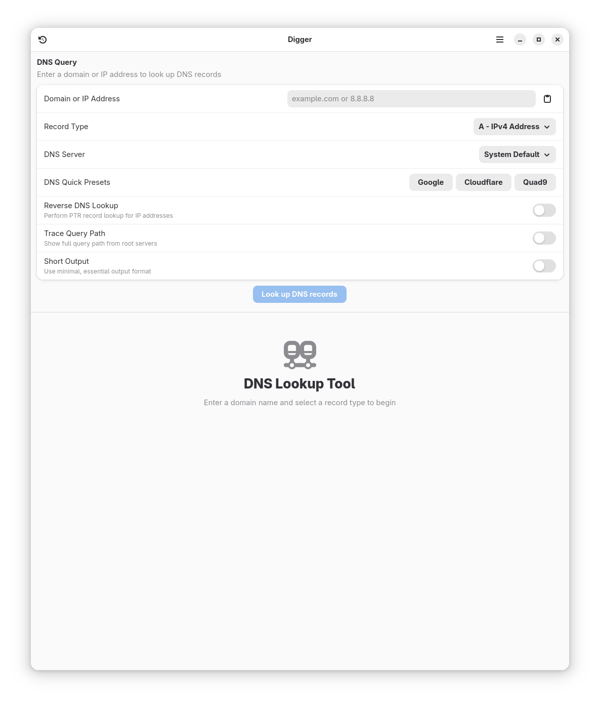
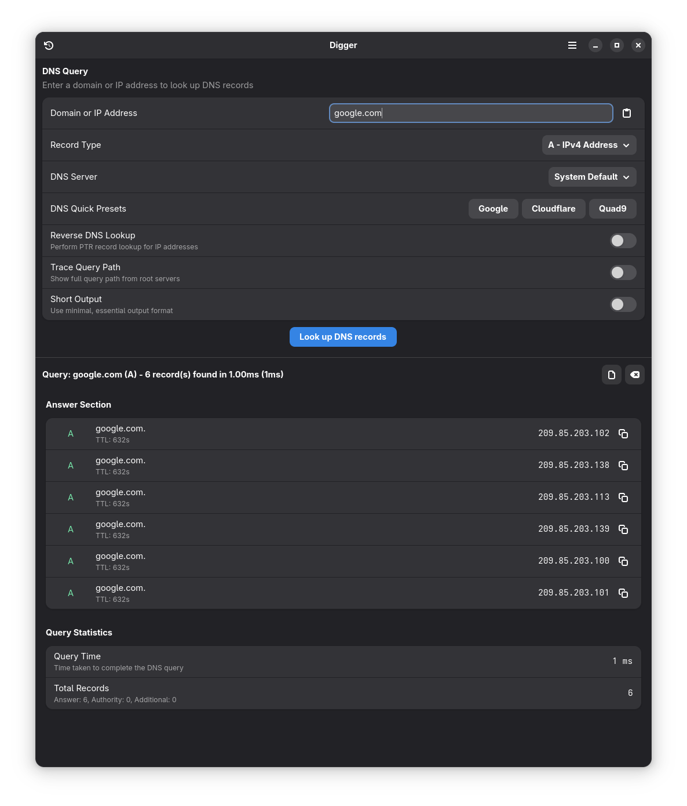
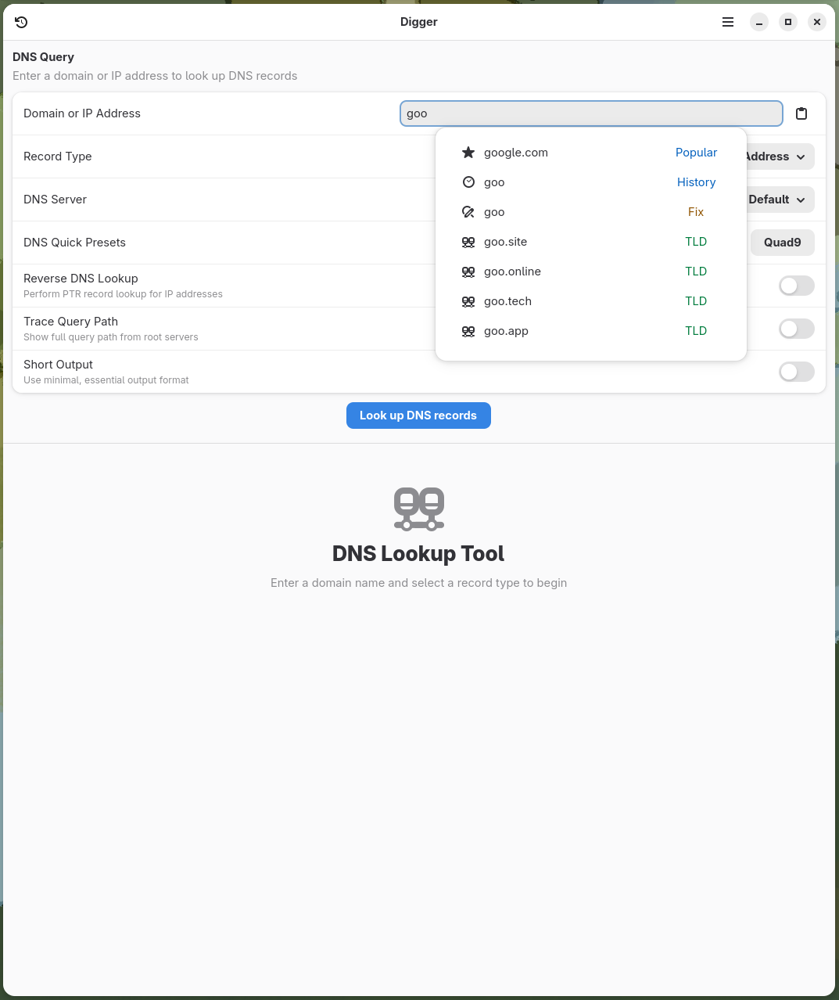
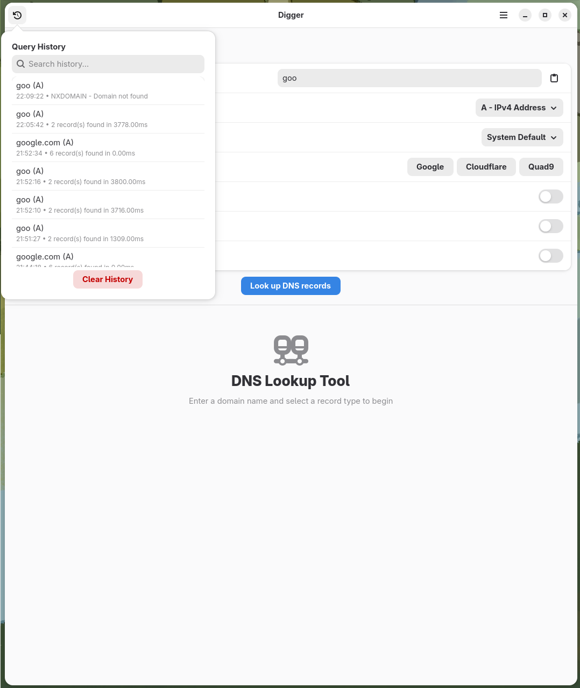
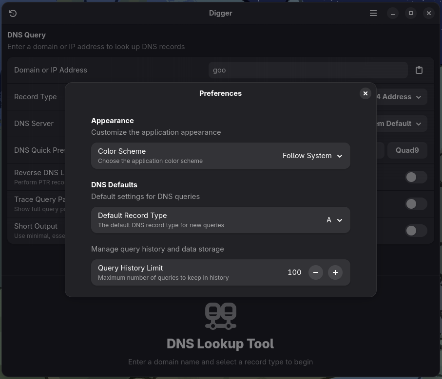

# Digger - DNS Lookup Tool

A modern DNS lookup tool built with Vala, GTK4, and libadwaita. Digger provides an intuitive interface for performing DNS queries, viewing results, and managing query history.

## Screenshots

<div align="center">

### Main Interface

*Clean, modern interface for DNS lookups with instant autocomplete suggestions*

### DNS Query Results
  
*Detailed DNS record information with one-click copying and error handling*

### Smart Autocomplete

*Intelligent domain suggestions with keyboard navigation and usage tracking*

### Query History

*Advanced search and filtering through your DNS query history*

### Preferences

*Comprehensive settings for customizing behavior and appearance*

### About Dialog

*Modern about dialog with application information and version details*

</div>

## Features

- 🔍 **Comprehensive DNS Queries**: Support for all major DNS record types (A, AAAA, CNAME, MX, NS, PTR, TXT, SOA, SRV, ANY)
- ⚙️ **Advanced Options**: Reverse DNS lookup, trace queries, custom DNS servers, and short output format
- 📝 **Enhanced Query History**: Persistent history with advanced search, filtering, and management capabilities
- 🔄 **Smart Autocomplete**: Intelligent domain suggestions with usage tracking and quick selection
- 📋 **Clipboard Integration**: One-click copying of DNS record values and raw dig output
- ⌨️ **Keyboard Shortcuts**: Efficient navigation with comprehensive keyboard shortcuts
- 🎨 **Modern Interface**: Clean, adaptive UI built with libadwaita and blueprint templates
- 🌐 **Network Diagnostics**: Detailed error handling with proper NXDOMAIN, SERVFAIL, and timeout detection
- ⚙️ **Preferences**: Customizable themes, default settings, and history management
- 🚀 **Performance**: Native Vala implementation for optimal speed and resource usage

## Installation

### Prerequisites

**Fedora/RHEL:**
```bash
sudo dnf install vala meson gtk4-devel libadwaita-devel json-glib-devel libgee-devel bind-utils
```

**Ubuntu/Debian:**
```bash
sudo apt install valac meson libgtk-4-dev libadwaita-1-dev libjson-glib-dev libgee-0.8-dev dnsutils
```

**Arch Linux:**
```bash
sudo pacman -S vala meson gtk4 libadwaita json-glib gee bind
```

### Flatpak (Recommended)

```bash
# Install from Flathub (when available)
flatpak install flathub io.github.tobagin.digger
flatpak run io.github.tobagin.digger
```

**Current Status**: Flatpak builds are working perfectly! Both production and development manifests are fully functional with embedded `dig` command support.

### Building from Source

#### Using Build Scripts (Recommended)
```bash
git clone https://github.com/tobagin/Digger.git
cd Digger

# Production build
./build.sh

# Development build (with debug info)
./build.sh --dev

# Build and run development version
./build.sh --dev --run
```

#### Using Flatpak Builder (Manual)
```bash
git clone https://github.com/tobagin/Digger.git
cd Digger

# Install Flatpak build dependencies
sudo dnf install flatpak flatpak-builder  # Fedora/RHEL
# sudo apt install flatpak flatpak-builder  # Ubuntu/Debian
# sudo pacman -S flatpak flatpak-builder    # Arch Linux

# Add Flathub repository and install GNOME SDK
flatpak remote-add --if-not-exists flathub https://dl.flathub.org/repo/flathub.flatpakrepo
flatpak install flathub org.gnome.Platform//48 org.gnome.Sdk//48

# Build and install the Flatpak (Production)
flatpak-builder --user --install --force-clean build-dir packaging/io.github.tobagin.digger.yml
flatpak run io.github.tobagin.digger

# Build and install the Flatpak (Development)
flatpak-builder --user --install --force-clean build-dir-dev packaging/io.github.tobagin.digger.Devel.yml
flatpak run io.github.tobagin.digger.Devel
```

#### Traditional Meson Build
```bash
git clone https://github.com/tobagin/Digger.git
cd Digger
meson setup builddir
meson compile -C builddir
sudo meson install -C builddir
```

### Development

```bash
# Quick development build and run
./build.sh --dev --run

# Manual development run
flatpak run io.github.tobagin.digger.Devel

# Enable debug logging
G_MESSAGES_DEBUG=all flatpak run io.github.tobagin.digger.Devel
```

## Usage

### Basic DNS Lookup
1. Enter a domain name (e.g., `example.com`)
2. Select the DNS record type
3. Click "Look up DNS records" or press Enter

### Advanced Options
Expand the "Advanced Options" section to access:
- **Reverse DNS Lookup**: Check for IP address reverse resolution
- **Trace Query Path**: See the full resolution path from root servers
- **Short Output**: Get minimal, essential output only
- **Custom DNS Server**: Specify a custom DNS server (e.g., 8.8.8.8)

### Keyboard Shortcuts
- `Ctrl+L`: Focus the domain entry field
- `Ctrl+R`: Repeat the last query
- `Escape`: Clear results and return to empty state
- `Enter`: Submit query when in any input field

### Smart Autocomplete
- **Domain Suggestions**: Start typing a domain to see intelligent suggestions
- **Usage Tracking**: Frequently used domains appear first in suggestions
- **Keyboard Navigation**: Use arrow keys to navigate, Enter to select
- **Automatic Hiding**: Suggestions automatically hide after selection

### Enhanced Query History
- **Easy Access**: Click the history button in the header bar
- **Advanced Search**: Search through previous queries with real-time filtering
- **Smart Selection**: Click any history item to instantly repeat that query
- **No Autocomplete Interference**: History selection won't trigger autocomplete popover
- **Comprehensive Management**: Clear history or manage query limits in preferences

### Preferences & Customization
- **Theme Selection**: Choose between system, light, or dark themes
- **Default Settings**: Set default DNS record type and other preferences
- **History Management**: Configure query history limits and behavior
- **Modern Interface**: Clean preferences dialog with organized settings

## Architecture

Digger follows a clean, modular architecture:

```
Digger/
├── src/
│   ├── main.vala                    # Application entry point
│   ├── application.vala             # Main application class  
│   ├── window.vala                  # Main window and UI logic
│   ├── preferences-dialog.vala      # Preferences and settings
│   ├── dns-query.vala              # DNS query backend with enhanced parsing
│   ├── dns-record.vala             # Data models and enums
│   ├── query-history.vala          # History management
│   ├── query-result-view.vala      # Results display
│   ├── advanced-options.vala       # Advanced options panel
│   ├── ui/
│   │   ├── enhanced-query-form.vala    # Modern query input form
│   │   ├── enhanced-result-view.vala   # Enhanced results display
│   │   ├── enhanced-history-search.vala # Advanced history search
│   │   ├── autocomplete-dropdown.vala  # Smart autocomplete widget
│   │   └── theme-manager.vala          # Theme management
│   └── features/
│       ├── dns-presets.vala         # DNS server presets
│       └── domain-suggestions.vala  # Autocomplete suggestions engine
├── data/
│   ├── ui/*.blp                     # Blueprint UI templates
│   ├── *.gschema.xml               # GSettings schemas
│   └── icons/                       # Application icons
├── packaging/                       # Flatpak manifests
└── po/                             # Translations
```

## DNS Integration

Digger uses the embedded `dig` command for DNS resolution, providing:
- **Enhanced Error Handling**: Proper parsing of NXDOMAIN, SERVFAIL, REFUSED, and other DNS status codes
- **Comprehensive Record Support**: All standard DNS record types with proper parsing
- **Advanced Query Options**: Tracing, custom servers, reverse lookups, and short output
- **Detailed Diagnostics**: Query timing, server information, and comprehensive status reporting
- **Self-Contained**: Embedded dig command in Flatpak builds eliminates external dependencies

## Contributing

Contributions are welcome! Please feel free to submit issues and pull requests.

### Development Setup
1. Fork the repository
2. Create a feature branch
3. Make your changes
4. Test thoroughly
5. Submit a pull request

### Coding Guidelines
- Follow existing code style and patterns
- Add appropriate error handling
- Include descriptive commit messages
- Test changes with various DNS queries

## License

This project is licensed under the GNU General Public License v3.0 - see the [LICENSE](LICENSE) file for details.

## Acknowledgments

- Built with [Vala](https://vala.dev/) and [GTK4](https://gtk.org/)
- UI components from [libadwaita](https://gnome.pages.gitlab.gnome.org/libadwaita/)
- Inspired by the classic `dig` command-line tool
- Thanks to the GNOME and GTK communities for excellent documentation

## Recent Updates

### 🚀 Version 2.0.0 - Complete Vala Rewrite
- **Native Performance**: Complete rewrite from Python to Vala for optimal speed and resource usage
- **Enhanced DNS Parsing**: Proper handling of NXDOMAIN, SERVFAIL, REFUSED, and all DNS status codes
- **Smart Autocomplete**: Intelligent domain suggestions with usage tracking and keyboard navigation
- **Improved History**: Advanced search, filtering, and management with no autocomplete interference
- **Modern Preferences**: Comprehensive settings dialog with theme management and customization
- **Blueprint UI**: Modern declarative UI architecture with GTK4 Blueprint templates
- **Bug Fixes**: Resolved autocomplete popover issues, history button functionality, and DNS error handling
- **Self-Contained**: Embedded dig command in Flatpak builds eliminates external dependencies

The application now provides a significantly enhanced user experience with native performance and modern features!

---

**Note**: When building from source outside of Flatpak, Digger requires the `dig` command to be installed on your system. This is typically provided by the `bind-utils` (Fedora/RHEL), `dnsutils` (Ubuntu/Debian), or `bind` (Arch Linux) packages. **Flatpak builds include `dig` automatically.**
