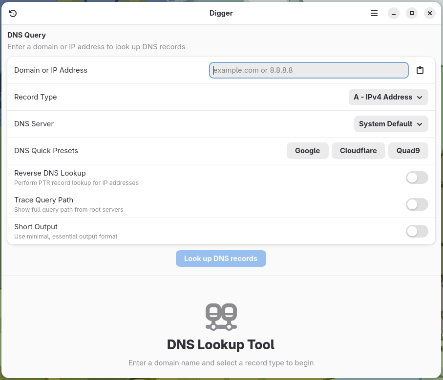
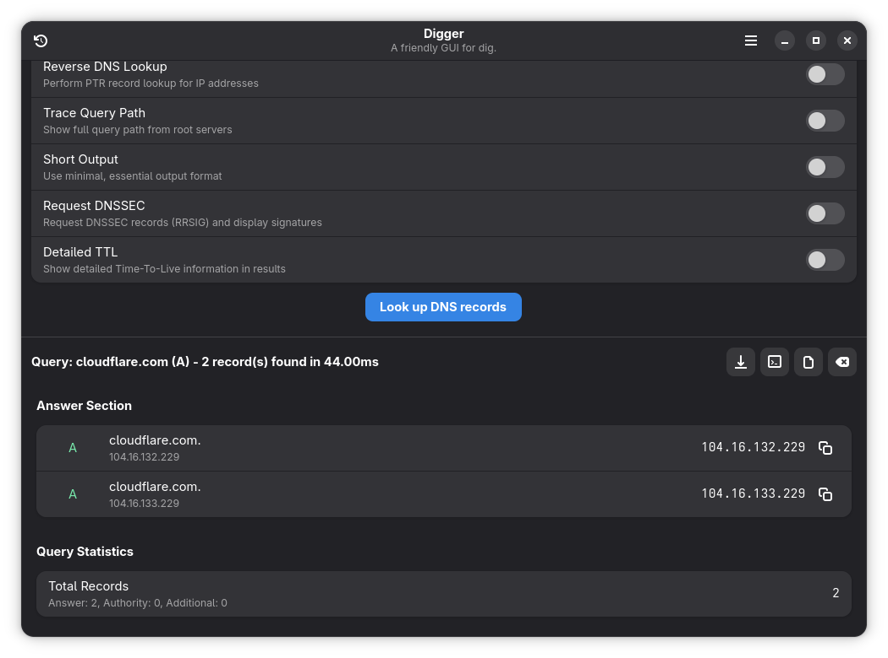
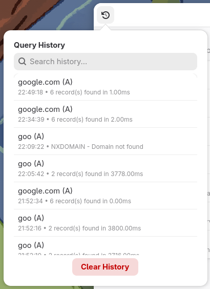

# Digger

A modern, feature-rich DNS lookup tool for the GNOME Desktop.

[](https://github.com/tobagin/digger/actions/workflows/ci.yml)

<div align="center">



<a href="https://flathub.org/en/apps/io.github.tobagin.digger"></a>
<a href="https://ko-fi.com/tobagin"></a>

</div>

## 🎉 Version 2.9.0 - Latest Release

**Digger 2.9.0** adds four new DNS tools, moves to the GNOME 51 runtime, and refreshes the bundled DNS tooling.

### ✨ Key Features

- **🔍 Advanced DNS Queries**: Support for all major DNS record types with DNSSEC validation.
- **🌍 Propagation Check**: Compare a record across eight public resolvers to see how far it has propagated.
- **🛡️ DNS Blacklist Checking**: Check IPs against multiple RBL providers in parallel.
- **🔒 Malware Domain Checking**: VirusTotal + Spamhaus DBL threat intel with safety scoring (Ctrl+Shift+T).
- **📊 Performance Monitor**: Real-time DNS latency visualization for major providers.
- **🌐 WHOIS Integration**: Domain registration lookup with intelligent caching.
- **📱 Responsive Design**: Beautiful adaptive layout for all screen sizes.

### 🆕 What's New in 2.9.0

- **Malware Domain Checking**: VirusTotal and Spamhaus DBL threat intelligence with 0-100 safety scoring (`Ctrl+Shift+T`).
- **Query Templates & Macros**: Save and reuse named query templates with `{{param}}` substitution, persisted across restarts (`Ctrl+Shift+L`).
- **DNS Record Validator**: RFC syntax and compliance checks for A/AAAA/CNAME/MX/TXT/NS/SOA records.
- **IPv6 Connectivity Testing**: Dual-stack detection and AAAA reachability over IPv6 transport.
- **GNOME 51 Runtime**: Built against the current GNOME platform.
- **BIND 9.20**: The bundled `dig` moves from the end-of-life 9.16 branch to 9.20.29.
- **Working DNSSEC Validation**: `dig` is now built with OpenSSL, so signed responses are genuinely verified.
- **Automated Tests**: First `meson test` suite, wired into CI.

For detailed release notes and version history, see [CHANGELOG.md](CHANGELOG.md).

## Features

### Core Features
- **Comprehensive DNS Support**: A, AAAA, MX, TXT, NS, CNAME, SOA, SRV, PTR, and more.
- **Advanced Options**: Reverse lookup, trace queries, custom servers, and short output.
- **Threat Intelligence**: Check domains against VirusTotal and Spamhaus DBL with safety scoring.
- **DNSSEC Validation**: Verify chain of trust with visual indicators.

### Productivity Tools
- **Server Comparison**: Compare response times and results across multiple DNS servers.
- **Propagation Check**: See how a record has propagated across eight public resolvers.
- **Subdomain Enumeration**: Discover live subdomains from a built-in wordlist.
- **DNSSEC Chain of Trust**: Walk the chain from the TLD down to your domain.
- **Domain Monitoring**: Watch domains and get notified when their records change.
- **Batch Lookup**: Query multiple domains at once from CSV/TXT files.
- **Export Manager**: Save results to JSON, CSV, text, or Zone file formats.
- **DNS Record Validator**: RFC syntax + compliance checks for A/AAAA/CNAME/MX/TXT/NS/SOA with structured errors/warnings (CNAME co-existence, MX target, SOA, TXT length); pure, synchronous, never blocks the query path.
- **Malware Domain Checking**: VirusTotal + Spamhaus DBL reputation, safety scoring, and historical threat data — opt-in in Preferences, also available as a dedicated dialog (Ctrl+Shift+T).
- **IPv6 Connectivity Testing**: Dual-stack detection, IPv6 reachability probe, and AAAA resolution over IPv6 with non-blocking results — DIGG-004.
- **Query Templates**: Persisted library of named, parameterised templates (e.g., `{{subdomain}}.example.com` MX @ 1.1.1.1) with `{{param}}` substitution — Save Current as Template & Template Library (Ctrl+Shift+L).
- **History & Favorites**: Keep track of your queries and save important domains.

### User Experience
- **Modern Interface**: Built with GTK4 and Libadwaita for a native GNOME feel.
- **Smart Autocomplete**: Intelligent suggestions as you type.
- **Clipboard Integration**: One-click copying of record values.
- **Keyboard Shortcuts**: Efficient navigation for power users.

## Installation

### Flathub (recommended)

```bash
flatpak install flathub io.github.tobagin.digger
```

### Fedora (official repositories, Fedora 43+)

```bash
sudo dnf install digger
```

### Debian (official repositories, currently in unstable/sid)

```bash
sudo apt install digger
```

### Direct download

Prebuilt `.deb` and `.rpm` packages are attached to every
[GitHub release](https://github.com/tobagin/digger/releases).

## Building from Source

```bash
# Clone the repository
git clone https://github.com/tobagin/digger.git
cd digger

# Build and install development version
./scripts/build.sh --dev
```

## Usage

### Basic Usage

Launch Digger from your applications menu or run:
```bash
flatpak run io.github.tobagin.digger
```

1. Enter a domain name (e.g., `example.com`).
2. Select the record type.
3. Press Enter or click "Look up".

### Keyboard Shortcuts

- `Ctrl+L` - Focus domain field
- `Ctrl+R` - Repeat last query
- `Ctrl+B` - Batch lookup
- `Ctrl+M` - Compare servers
- `Ctrl+Shift+T` - Malware Domain Check
- `Ctrl+Shift+L` - Template Library
- `Ctrl+Shift+B` - DNS Blacklist Check
- `Ctrl+,` - Preferences
- `F1` - About Digger

## Architecture

Digger is built with:
- **Language**: Vala
- **Toolkit**: GTK4 + Libadwaita
- **DNS Backend**: BIND `dig` (embedded)
- **Build System**: Meson

## Contributing

Contributions are welcome! Please feel free to submit issues and pull requests.
See [CONTRIBUTING.md](CONTRIBUTING.md) for more details.

## License

Digger is licensed under the [GPL-3.0-or-later](LICENSE).

## Acknowledgments

- **GNOME**: For the amazing GTK toolkit.
- **Vala**: For the programming language.
- **BIND**: For the powerful `dig` tool.

## Screenshots

| Main Window | Query Results | History |
|-------------|---------------|---------|
|  |  |  |

---

**Digger** - Made with ❤️ using Vala, GTK4, and libadwaita.
