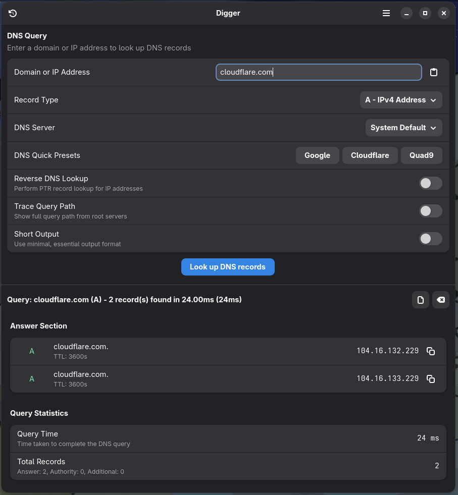

# Digger

A modern, feature-rich DNS lookup tool for the GNOME Desktop.

<div align="center">


<a href="https://flathub.org/en/apps/io.github.tobagin.digger"></a>
<a href="https://ko-fi.com/tobagin"></a>

</div>

## 🎉 Version 2.6.1 - Latest Release

**Digger 2.6.1** brings documentation improvements and metadata updates.

### ✨ Key Features

- **🔍 Advanced DNS Queries**: Support for all major DNS record types with DNSSEC validation.
- **🛡️ DNS Blacklist Checking**: Check IPs against multiple RBL providers in parallel.
- **📊 Performance Monitor**: Real-time DNS latency visualization for major providers.
- **🌐 WHOIS Integration**: Domain registration lookup with intelligent caching.
- **📱 Responsive Design**: Beautiful adaptive layout for all screen sizes.

### 🆕 What's New in 2.6.1

- **Documentation**: Simplified README structure and improved build instructions.
- **Metadata**: Shortened summary and refined description.
- **Branding**: Added official branding colors.

For detailed release notes and version history, see [CHANGELOG.md](CHANGELOG.md).

## Features

### Core Features
- **Comprehensive DNS Support**: A, AAAA, MX, TXT, NS, CNAME, SOA, SRV, PTR, and more.
- **Advanced Options**: Reverse lookup, trace queries, custom servers, and short output.
- **Secure DNS**: DNS-over-HTTPS (DoH) support for Cloudflare, Google, and Quad9.
- **DNSSEC Validation**: Verify chain of trust with visual indicators.

### Productivity Tools
- **Server Comparison**: Compare response times and results across multiple DNS servers.
- **Batch Lookup**: Query multiple domains at once from CSV/TXT files.
- **Export Manager**: Save results to JSON, CSV, text, or Zone file formats.
- **History & Favorites**: Keep track of your queries and save important domains.

### User Experience
- **Modern Interface**: Built with GTK4 and Libadwaita for a native GNOME feel.
- **Smart Autocomplete**: Intelligent suggestions as you type.
- **Clipboard Integration**: One-click copying of record values.
- **Keyboard Shortcuts**: Efficient navigation for power users.

## Building from Source

```bash
# Clone the repository
git clone https://github.com/tobagin/digger.git
cd digger

# Build and install development version
./scripts/build.sh --dev
```

## Usage

### Basic Usage

Launch Digger from your applications menu or run:
```bash
flatpak run io.github.tobagin.digger
```

1. Enter a domain name (e.g., `example.com`).
2. Select the record type.
3. Press Enter or click "Look up".

### Keyboard Shortcuts

- `Ctrl+L` - Focus domain field
- `Ctrl+R` - Repeat last query
- `Ctrl+B` - Batch lookup
- `Ctrl+M` - Compare servers
- `Ctrl+,` - Preferences
- `F1` - About Digger

## Architecture

Digger is built with:
- **Language**: Vala
- **Toolkit**: GTK4 + Libadwaita
- **DNS Backend**: BIND `dig` (embedded)
- **Build System**: Meson

## Contributing

Contributions are welcome! Please feel free to submit issues and pull requests.
See [CONTRIBUTING.md](CONTRIBUTING.md) for more details.

## License

Digger is licensed under the [GPL-3.0-or-later](LICENSE).

## Acknowledgments

- **GNOME**: For the amazing GTK toolkit.
- **Vala**: For the programming language.
- **BIND**: For the powerful `dig` tool.

## Screenshots

| Main Window | Query Results | History |
|-------------|---------------|---------|
|  |  |  |

---

**Digger** - Made with ❤️ using Vala, GTK4, and libadwaita.
